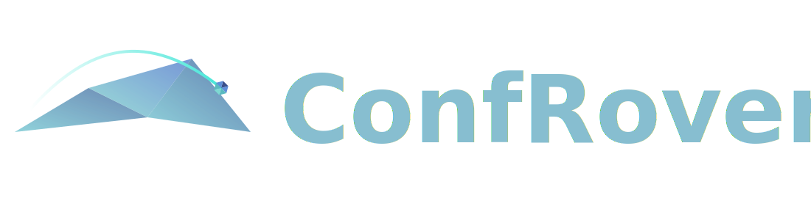
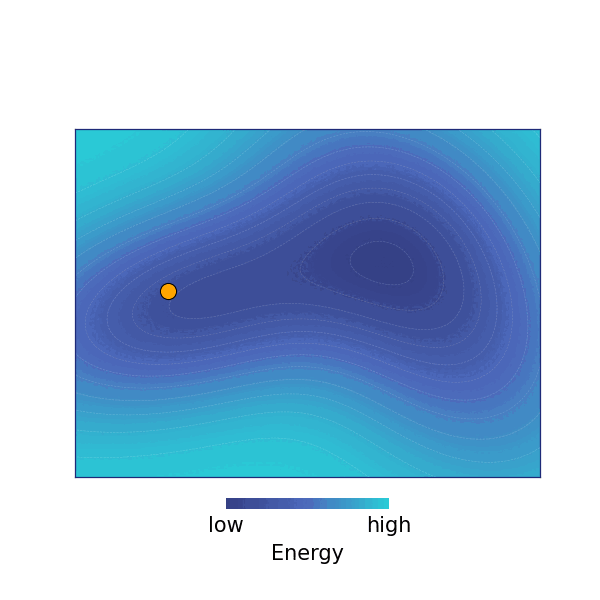
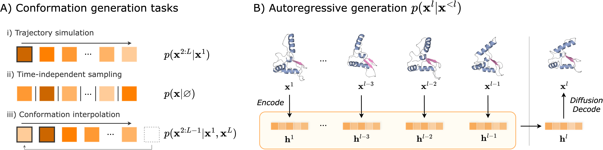

<div align="center"> 
<h1>


Learning Protein Conformation and Dynamics through Autoregression
</div>


<div align="center"

[](https://arxiv.org/abs/2505.17478)
[](https://huggingface.co/collections/ByteDance-Seed/confrover)
[](https://bytedance-seed.github.io/ConfRover)

</div>

## Table of Contents
- [Introduction](#introduction)
- [Updates](#updates)
- [Pretrained models](#pretrained-models)
- [Quick Start](#quick-start)
  - [Installation](#installation)
  - [Python API](#python-api)
  - [Command Line Interface](#command-line-interface)
- [Limitations](#limitations)
- [License](#license)
- [Citations](#citing-confrover)

## Introduction

Proteins are flexible molecules, and capturing their dynamics is essential for understanding their functions. Molecular dynamics (MD) simulations model these dynamics by sampling conformational ensembles from an underlying energy landscape defined by physical force fields, providing rich data for studying protein conformational behavior.

<div align="center">
<div style="display: flex; justify-content: center; align-items: center; gap: 20px; flex-wrap: wrap">
  
  
</div>
  <figcaption width="480" color="gray">
    An illustration of protein dynamics generated by MD simulation (left), by sampling from the energy landscape defined by a physical model (right).
  </figcaption>
    <br>
</div>


ConfRover is a deep generative model that learns to produce dynamic protein trajectories directly from MD data. It generates conformational frames in a trajectory autoregressively, sampling each next frame conditioned on historical context. Building on a causal transformer architecture widely used in language models, ConfRover enables efficient training and jointly learns the distribution of protein conformations and their temporal evolution at coarse time steps, offering a fast proxy for expensive MD simulations.

By modeling different dependency patterns, ConfRover supports various tasks:

| Tasks | Input condition |
| --- |--- |
| Forward simulation |  amino acid sequence $`\mathbf{s}`$, starting frame $`\mathbf{x}_1`$,number of frames $`L`$,  time interval (stride) $`\Delta t`$|
| IID sampling  | amino acid sequence $`\mathbf{s}`$, number of samples $`N`$ |
| State interpolation |amino acid sequence $`\mathbf{s}`$, starting frame $`\mathbf{x}_1`$, ending frame $`\mathbf{x}_2`$, number of frames $`L`$,  time interval (stride) $`\Delta t`$|


See our [paper](https://arxiv.org/abs/2505.17478) and [website](https://bytedance-seed.github.io/ConfRover/) for more details.
<br>


<p align="center">

<figcaption width="480"> (A) ConfRover unifies the learning of conformational distributions and their temporal evolution through frame-level conditioning, enabling multiple tasks. (B) Its general autoregressive formulation captures temporal dependencies directly from data using a causal transformer.
</figcaption>
</p>


## Updates

- [2025-11] ConfRover v1.0 released!
- [2025-09] ConfRover is accepted to NeurIPS 2025!

> #### 🔔 Stay Updated
> ConfRover is under active development. Click **Watch** to follow new updates and releases.


## Pretrained models

We provide a list of pretrained models from the ConfRover family:

| Model | Best for | Downloaded Checkpoints |
| --- | --- |--- |
| `ConfRover-base-20M-v1.0` | Forward simulation and IID sampling | <a href="https://huggingface.co/ByteDance-Seed/ConfRover-base-20M-v1.0"></a> |
| `ConfRover-interp-20M-v1.0` | State interpolation | <a href="https://huggingface.co/ByteDance-Seed/ConfRover-interp-20M-v1.0"></a> |

Pretrained model checkpoints can also be downloaded through `ConfRover.from_pretrained(model_name)`.


## Quick Start
### Installation

```bash
# [recommended] use conda environment
conda create -n confrover python=3.10
conda activate confrover

# clone ConfRover repository
git clone https://github.com/ByteDance-Seed/ConfRover.git
cd ConfRover

# first install confrover and other dependencies, then openfold (requires torch pre-installed)
pip install . && pip install --no-build-isolation .[openfold]
```
> ConfRover has been tested on NVIDIA H100 with CUDA 12.6

### Python API

ConfRover is installed as a Python package and provides a simple API for generating conformations or trajectories for a single case. See following snippet and `examples\` folder:

```python
from confrover.model import ConfRover

# Load pretrained model
model = ConfRover.from_pretrained("ConfRover-base-20M-v1.0") # see method for optional arguments

# Move to GPU
model.to("cuda:0")

# Task 1: forward simulation
model.generate(
    case_id="6j56_A",
    seqres="ARQREIEMNRQQRFFRIPFIRPADQYKDPQSKKKGWWYAHFDGPWIARQMELHPDKPPILLVAGKDDMEMCELNLEETGLTRKRGAEILPRQFEEIWERCGGIQYLQNAIESRQARPTYATAMLQSLLK",
    task_mode="forward",
    output_dir="/path/to/output/fwd/",
    n_replicates=1,
    n_frames=10, # total number of frames (including the starting frame)
    stride_in_10ps=256, # time interval between frames in the unit of 10 ps.
    conditions="/path/to/examples/6j56_A_start.pdb", # start frame
)

# Task 2: Independent ensemble sampling
model.generate(
    case_id="6j56_A",
    seqres="ARQREIEMNRQQRFFRIPFIRPADQYKDPQSKKKGWWYAHFDGPWIARQMELHPDKPPILLVAGKDDMEMCELNLEETGLTRKRGAEILPRQFEEIWERCGGIQYLQNAIESRQARPTYATAMLQSLLK",
    task_mode="iid",    
    output_dir="/path/to/output/iid/",
    n_replicates=50, # number of conformation samples
)

# Task 3: interpolating two conformations
model.generate(
    case_id="6j56_A",
    seqres="ARQREIEMNRQQRFFRIPFIRPADQYKDPQSKKKGWWYAHFDGPWIARQMELHPDKPPILLVAGKDDMEMCELNLEETGLTRKRGAEILPRQFEEIWERCGGIQYLQNAIESRQARPTYATAMLQSLLK",
    task_mode="interp",
    output_dir="/path/to/output/interp/",
    n_replicates=5,
    n_frames=9,
    stride_in_10ps=256,
    conditions = [
        "/path/to/examples/6j56_A_start.pdb",
        "/path/to/examples/6j56_A_end.pdb",
    ],
)
```

Method `ConfRover.generate()` is designed for simple runs or integrating ConfRover into customized pipelines. For batch generation, we recommend using the command line interface.

### Command line interface

ConfRover provides a command line interface for parallel generation over multiple GPUs. A `.json`` manifest file is required to specify the generation tasks and cases. 

```bash
confrover generate \
    --job_config <path/to/job_manifest.json> \
    --output <path/to/output_dir> \
    --model <model_name/weight_path> \
    [...] 

# See `confrover generate --help` for detailed arguments.
```

#### Input manifest format

ConfRover uses JSON files to define generation tasks for forward simulation, interpolation, and IID sampling. 
The file specifies basic dataset information and a list of `cases`, each describing the protein name, animo acid sequence, and optional conditioning frames for trajectory generation. 
Conditioning frames can be provided from conformations in `.pdb` files or from specific frames in an `.xtc` trajectory file (using frame indices).
Following examples show the format to define each generation jobs.

1. **Forward simulation**: generate protein motion trajectories from an initial conformation ("condition") at a specified stride.

    ```json5
    {
        "name": "job_name", 
        "task_mode": "forward",
        "n_replicates": 1, // <int> number of replicated trajectories for each case.
        "n_frames": 100, // <int> number of frames in each generated trajectory (including the conditioning frame).
        "stride_in_10ps": 120, // <int> interval between frames in the unit of 10 ps.
        "cases": [
            // Option 1: starting from a pair of .pdb files
            {
                "case_id": "7jfl_C", // case_id must be unique
                "seqres": "SALQDLLRTLKSPSSPQQQQQVLNILKSNPQLMAAFIKQRTAKYVAN", // amino acid sequence
                "conditions": "/path/to/7jfl_C.pdb" // <str> path to the starting .pdb file
            },
            // Option 2: starting from a time frame defined in a .xtc file
            {
                "case_id": "7lp1_A",
                "seqres": "VTQSFLPPGWEMRIAPNGRPFFIDHNTKTTTWEDPRLKF",
                "conditions": {
                    "xtc_fpath": "/path/to/7lp1_A.xtc", // <str> .xtc file contains trajectory information
                    "pdb_fpath": "/path/to/7lp1_A.pdb", // <str> corresponding .pdb file contaisn the molecule topology
                    "frame_idxs": 1000 // <int> time frame index in trajectory to start from 
                }
            },
            ...
        ]
    }
    ```


2. **Independent ensemble sampling**: directly sample independent conformations.
    ```json5
    {
        "name": "job_name", 
        "task_mode": "iid",
        "n_replicates": 500, // <int> number of conformation samples
        "cases": [
            {
                "case_id": "7jfl_C",
                "seqres": "SALQDLLRTLKSPSSPQQQQQVLNILKSNPQLMAAFIKQRTAKYVAN",
                // iid sampling does not need conditioning frames
            },
            ...
        ]
    }
    ```


3. **Conformation interpolation**: generate interpolating trajectories between two specified conformations ("conditions") with a specified trajectory length and stride.
    ```json5
    {
        "name": "job_name", 
        "task_mode": "interp",
        "n_replicates": 1, // <int> number of replicated trajectories for each case.
        "n_frames": 10, // <int> number of frames in each generated trajectory (including the conditioning frames).
        "stride_in_10ps": 120, // <int> interval between frames in the unit of 10 ps.
        "cases": [
            // Option 1: use a pair of .pdb files as start/end conditions
            {
                "case_id": "7jfl_C",
                "seqres": "SALQDLLRTLKSPSSPQQQQQVLNILKSNPQLMAAFIKQRTAKYVAN",
                "conditions": [
                  "/path/to/7jfl_C_start.pdb",  // <str> path to the starting .pdb file
                  "/path/to/7jfl_C_end.pdb",    // <str> path to the ending .pdb file
                ]
            },
            // Option 2: using two time frames defined in a .xtc file as start/end conditions
            {
                "case_id": "7lp1_A",
                "seqres": "VTQSFLPPGWEMRIAPNGRPFFIDHNTKTTTWEDPRLKF",
                "conditions": {
                    "xtc_fpath": "/path/to/7lp1_A.xtc", // <str> .xtc file contains trajectory information
                    "pdb_fpath": "/path/to/7lp1_A.pdb", // <str> corresponding .pdb file contaisn the molecule topology
                    "frame_idxs": [1000, 3000] // <int> a pair of time frame indices in trajectory to use as start/end conditions
                }
            },
            ...
        ]
    }
    ```


#### Result structure

ConfRover saves generation results for each job under the output `<job_name/>` directory, with each case saved in a separate subdirectory and replicates are suffixed with `_sample<idx>`. By default, ConfRover save dense trajectories in `.xtc` format and sparse sampled trajectories (e.g., 20 frames) in `.pdb` format for preview. Metadata for each run is saved in `.info` files.

An example output folder structure:
```bash
job_name/
├── case_id_1/
│   ├── case_id_1_sample0.xtc   # xtc trajectory file
│   ├── case_id_1_sample0.pdb   # pdb topology file
│   ├── case_id_1_sample0_preview.pdb   # pdb file contains sampled conformations for preview
│   ├── case_id_1_sample0.info  # json format metadata for the run
│   ├── case_id_1_sample1.xtc
│   ├── case_id_1_sample1.pdb
│   ├── case_id_1_sample1_preview.pdb
│   ├── case_id_1_sample1.info
│   └── ...
├── case_id_2/
│   └── ...
└── ...

```

#### Intermediate cache assets

ConfRover leverages state-of-the-art folding models to extract protein-level representations as an input. 
We cache and reuse the MSA and protein representations for efficient generation. 
We use the `$(pwd)/confrover_cache` as the default cache location to save these intermediate assets and model weights. Use the `--cache_dir` argument to specify a different cache location. See `--help` for more details.


<!-- ## Advanced usage

### Reproduce ATLAS results
Coming soon! -->


## Limitations

- **Protein-only, single-chain.** Current ConfRover models support only proteins and assume a single polypeptide chain.
- **Out-of-scope use.** ConfRover-v1.0 is trained mainly on the ATLAS dataset with 100 ns trajectories, which may restrict learned dynamics to short-timescale, local motions.
- **Backbone-focused diffusion.** Diffusion operates on backbone SE(3) space, with side chains reconstructed through predicted torsional angles, which may reduce accuracy for large rotamer changes.


## License

ConfRover code and model weights are licensed under the [Apache-2.0 License](LICENSE).


## Questions and Issues

Please feel free to [reach out to us](mailto:yuning.shen@bytedance.com) or [open an issue](https://github.com/ByteDance-Seed/ConfRover/issues) if you encounter any problems or have any questions.

## Contributing to ConfRover
We welcome contributions from the community to further improve ConfRover! Please check [Contributing](CONTRIBUTING.md) for more details. 

## Code of Conduct
We are committed to create a safe and inclusive environment for all contributors. Please review our [Code of Conduct](CODE_OF_CONDUCT.md) for more details.

## Security

If you discover a potential security issue in this project, or think you may have discovered a security issue, we ask that you notify Bytedance Security via our [security center](https://security.bytedance.com/src) or [vulnerability reporting email](sec@bytedance.com).

Please do **not** create a public GitHub issue.


## Acknowledgements

ConfRover builds on prior open source work with components adapted from [ColabFold](https://github.com/sokrypton/ColabFold), [OpenFold](https://github.com/aqlaboratory/openfold), [Ligo-Biosciences](https://github.com/Ligo-Biosciences/AlphaFold3), [SE3-Diffusion](https://github.com/jasonkyuyim/se3_diffusion). We gratefully acknowledge these contributions.

## Citing ConfRover

If you find ConfRover useful in your research, please cite the following paper:

```latex
@article{confrover2025,
  title={Simultaneous Modeling of Protein Conformation and Dynamics via Autoregression},
  author={Shen, Yuning and Wang, Lihao and Yuan, Huizhuo and Wang, Yan and Yang, Bangji and Gu, Quanquan},
  journal={arXiv preprint arXiv:2505.17478},
  year={2025}
}
```
